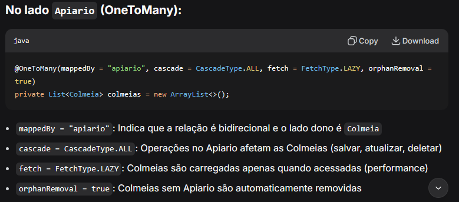
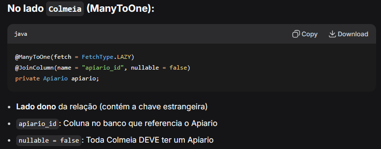
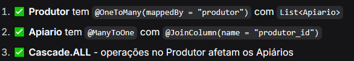

* Quando adicionar segurança, lembrar de criptografar senha no service de produtor antes de mandar para o banco de dados
* relatorio de vistoria
* no service de produtor tem como atualizar email mas verificar com a galera do front posteriormente, a funcionalidade não é bem assim
  - vale para email e senha do produtor (talvez telefone)
* verificar com o pessoal a questão da deleção do apiário
  - está permitindo deletar apenas sem colméias ativas (apenas com inativas)

# Relacionamentos:
## Colméia x Apiário

## Apiário x Produtor

---

# Ajustes Realizados (15/04/2026)

## 1. DTOs e Entidades
- **ApiarioRetornoDTO**: Adicionado campo `Long id`.
- **ColmeiaRetornoDTO**: Adicionado campo `Long id`.
- **InsumoRetornoDTO**: Adicionado campo `Long id`.
- **VistoriaRetornoDTO**: Adicionado campo `Long id`.
- **VistoriaAtualizadaDTO**: Removidos campos redundantes `apiario_id` e `colmeia_id`.
- **ColmeiaAtualizadaDTO**: Removido campo redundante `apiario_id`.

## 2. Autenticação e Login
- **ProdutorRepository**: Adicionados métodos `findByEmail` e `findByEmailAndSenha`.
- **LoginDTO**: Criado DTO para a requisição de login (email e senha).
- **AutenticacaoController**: Criado endpoint `POST /login` que retorna o `ProdutorRetornoDTO` em caso de sucesso.

## 3. Serviços e Mapeamento
- **ColmeiaService / VistoriaService**: Ajustados para não utilizar os IDs redundantes nos métodos de atualização.
- **ColmeiaMapper / VistoriaMapper**: Atualizados para refletir as mudanças nos DTOs de atualização.

## 4. Docker e Orquestração
- **Frontend (mobile)**: Criado `Dockerfile` para build da versão web do Expo e serviço via Nginx.
- **Root Docker Compose**: Criado `docker-compose.yml` na raiz do projeto para orquestrar:
  - `db`: PostgreSQL 18.
  - `backend`: Aplicação Spring Boot (porta 8080).
  - `frontend`: Aplicação Mobile/Web (porta 80).
